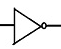
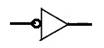

Q1. When a Logic 1 is applied on the input of a NOT gate, the output is ______.
A . **Logic 0**
B . Logic 1
C . High Impedance (Z)
D . None of these

Q2. If the 8-bit input is set to 1111 0000, the output of the 1’s complement circuit is ___________.
A . 1111 1111
B . 0000 0000
C . **0000 1111**
D . 1010 0101

Q3. For the NOT gate shown , what is the active output state?
A . 1
B . **0**
C . High Impedance (Z)
D . None of these

Q4. For the symbol shown,  with a bubble on the input side, the active input state is _______.
A . 1
B . **0**
C . High Impedance (Z)
D . None of these

Q5. A bubble on the input or output of any logic element refers to ___________.
A . ANDing
B . ORing
C . **Complementation**
D . Zero
