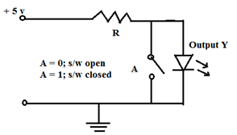
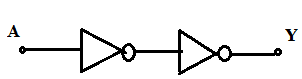

Q1. The output of the circuit shown below represents which of the following operations?

A . ANDing
B . ORing
C . **Inverting**
D . Buffering

Q.2 A byte 10101100 is applied as input to a 8-bit complementing logic circuit. The output will be:

A . 00001111
B . 10100011
C . 11111100
D . **01010011**

Q3. The output of the combinational logic shown in figure below is given by the Boolean expression:

A . Y = 1
B . Y = 0
C . **Y = A**
D . Y = A'

Q4. The output of the expression AB.A'= ______.

A . A
B . A'
C . **0**
D . 1

Q 5. The output of the expression A'(A + A') = _______.

A . A
B . **A'**
C . 1
D . 0

