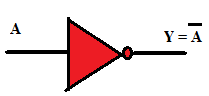
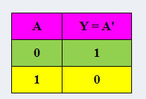
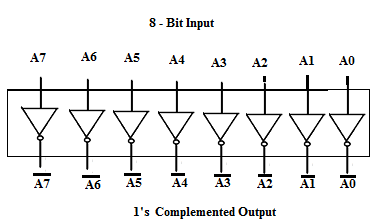
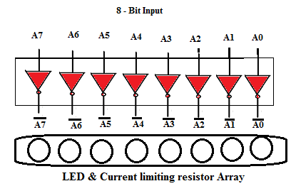

1 INTRODUCTION

The NOT gate (Inverter) performs the operation called as inversion or complementation. In Boolean algebra, the inverse or opposite of a number is referred to as complement. The complement of a 1 is a 0. It is expressed as a bar over the variable. The NOT gate (Inverter) changes one logic level to another logic level. A NOT gate is a logic circuit that has only one input and one output. It changes a 1 at its input to a 0 at the output and vice-versa. In other words, if an input to the NOT gate is LOW, then the output would be HIGH and vice-versa.

1.1 NOT GATE

|Description|Produces a HIGH output if the input is LOW and vice versa.|
|----|----|
|Symbol||
|Truth Table| |
   

1.2 APPLICATION: 1'S COMPLEMENT OF AN 8-BIT NUMBER

A total of eight- NOT gates are to be used to get the 1's complement of the 8-bit input. IC 74LS04 TTL Hex Inverter or IC 74HCT04 CMOS Hex Inverter consists of six NOT gates. Two such IC's are required to design an eight-bit complement circuit. The 2's complement = 1's complement plus 1. The eight - bit complement circuit can be used in circuits where 8-bit binary subtraction is done using 1's or 2's complement technique.

1.3 CONCEPT

A NOT gate produces a LOW output for a HIGH input and a HIGH output for a LOW input. This property of inversion allows the use of NOT gate to get the 1's complement of the given input. When a bubble appears on the output means a 0 is the active output state. Such an output is called as active-Low output.
